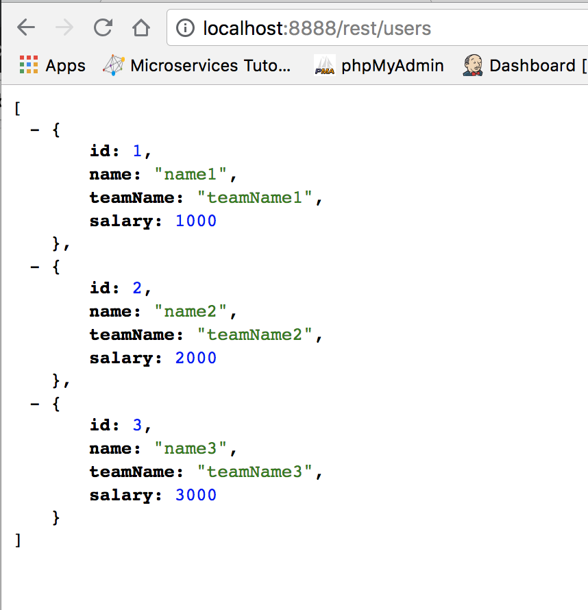
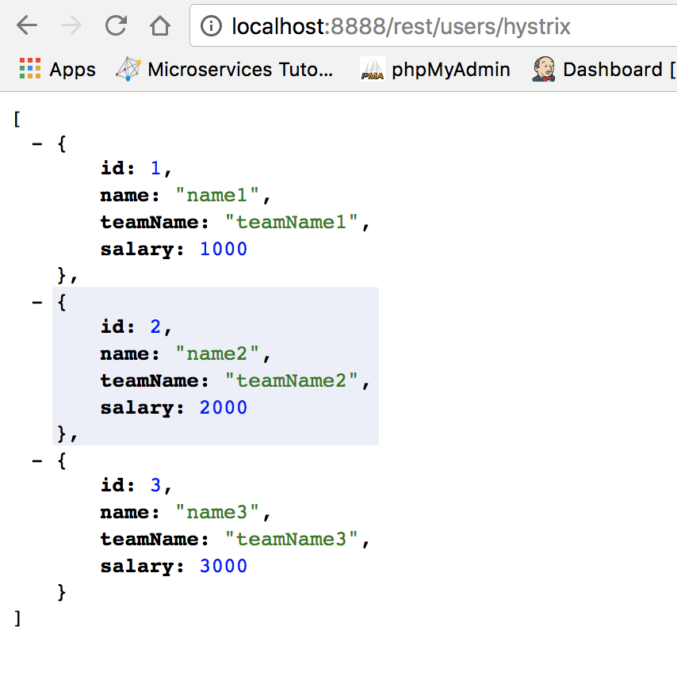

# Spring Hystrix Example
- This project depicts the Hystrix with Spring Hystrix and Spring Data REST Example.
## Description
- Start this application first: https://github.com/qingjie/request_reply_kafka.
- This Project shows the list of Users which are stored in another microservice `http://localhost:8080/user/hello`

Using the following endpoints, different operations can be achieved:
- `/rest/users` - This returns the list of Users from another microservice(General)

- `/rest/users/hystriz` - This returns the list of Users and safegaurded by Spring Cloud Hystrix using Fallback implementation.

